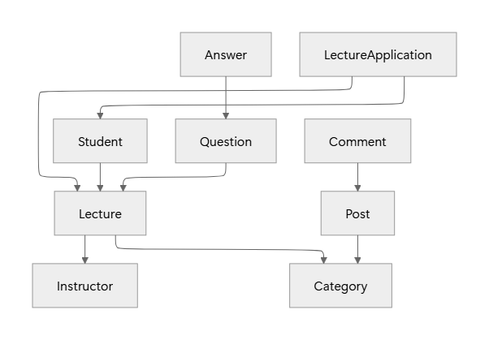

### 개요
- 블루칼라 직군 종사자를 위한 온라인 강의 플랫폼
- 기회비용이 큰 도제식 학습 구조를 온라인 교육 허브로 해결

### 핵심 기능
| 핵심 기능         | 세부 기능                                 |
|---------------|---------------------------------------|
| 강의 검색/관리      | - 카테고리 필터링   - 좋아요   - 진도율 확인 |
  | 강의 스트리밍 (HLS) | - 화질 및 속도 조절                          |
  | 강의 결제/정산      | - PG 연동   - 판매가/순수익               |
  | 커뮤니티          | - 분야별 커뮤니티   - 강의 리뷰 및 Q&A        |
- 상단에서부터 하단으로 구현

### ERD

| 강사                | 학생                            | 카테고리               | 강의                                                      | 질문                          | 답변                         | 수강 신청                                       | 게시글                                                         | 댓글                                                             |
|-------------------|-------------------------------|--------------------|---------------------------------------------------------|-----------------------------|----------------------------|---------------------------------------------|-------------------------------------------------------------|----------------------------------------------------------------|
| - 이름    - 정산금 | - 이름    - 좋아요 누른 강의 \*..* | - 레이블    - 아이콘 | - 강사 *..1    - 카테고리 *..1    - 강의 소개    - 가격 | - 강의 *..1    - 작성자 *..1 | - 질문 *..1   - 작성자 *..1 | - 강의 *..1   - 학생 *..1   - 결제 영수증  1 | - 카테고리 1   - 작성자 *..1   - 제목   - 내용   - 조회수 | - 게시글 *..1   - 작성자 *..1   - 내용   - 좋아요   - 싫어요 |

### 기술적 도전
| 목표          | 작업                                   | KPI                                    |
|-------------|--------------------------------------|----------------------------------------|
| 스트리밍 구현     | - 접근 권한 (Presigned URL)              |                                        |
| 안정성         | - 결제 원자성   - 재시도 로직              |                                        |
| 지연 시간 최적화   | - 캐시   - 이미지 리사이징   - 쿼리 최적화 | - 지연 시간   - TPS                    |
  | 리소스 최적화     | - 캐시   - 커넥션 풀 관리                | - TPS                                  |
  | 고가용성 및 수평확장 | - DB 읽기 전용 복제본   - 다중 AZ, 로드밸런싱  | - Docker Compose   - AWS → 구현 후 삭제 |
  | 확장성         | - 이벤트 구조   - 멀티 모듈               | 여쭤보기                                   |
- 모니터링 도구를 연결한 다음, KPI를 측정하며 실험 결과 정리

### 목표
- 월간 활성 사용자(MAU) 10만 명
- 일간 활성 사용자(DAU) 3,500명
- 리소스도 다르고, 사용자 패턴도 다를 것이므로, TPS를 측정하는 것으로 대체

### 질문
- 코드 확장성을 고려하는 방식
    - 이벤트 리스너 loose-coupling
    - 멀티 모듈 사용하는 방법
- 스트리밍 구현 관련 조언